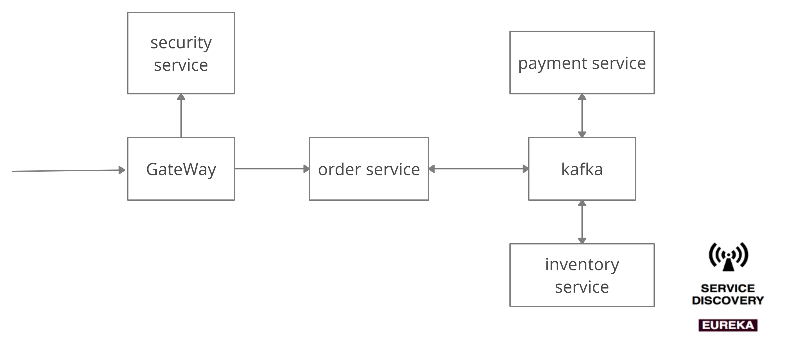

# market
Market project.  

  
# Run:  
docker-compose -d up  
kafka ui:  
http://localhost:8085/  

## Postman Collection:  

  
  
## TODO:  
Unit tests(Junit5), it(wiremock), Authorization(Token), Add unsuccessfull states to order, Spring state machine(for order states, not sure), Jaeger
  
  
## Путь Order:  
1 order-service сохраняет Order с OrderCreatedState
2 orded-service пушит ивен в кафку  
3 article-inventory берет ивент и резервирует товар  
4 в случае успеха пушит OrderConfirmedEvent  
5 payment-service уменьшает баланс  
6 в случае успеха пушит OrderCompletedEvent  
7 order-service слушает все изменения состояния заказа и обновляет state в бд(нужен отдельный мс наверное, а логику создания заказа вынести в orchestrator, но хотелось реализовать паттерн хореографии)  
  
Список квизов:  
  
  
  
## Unit Tests:  
Junit5, Mockito - in Order Service
  
## Integrational Tests:  
Wiremock - in Order Service
